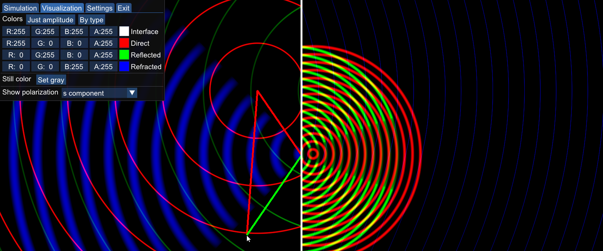
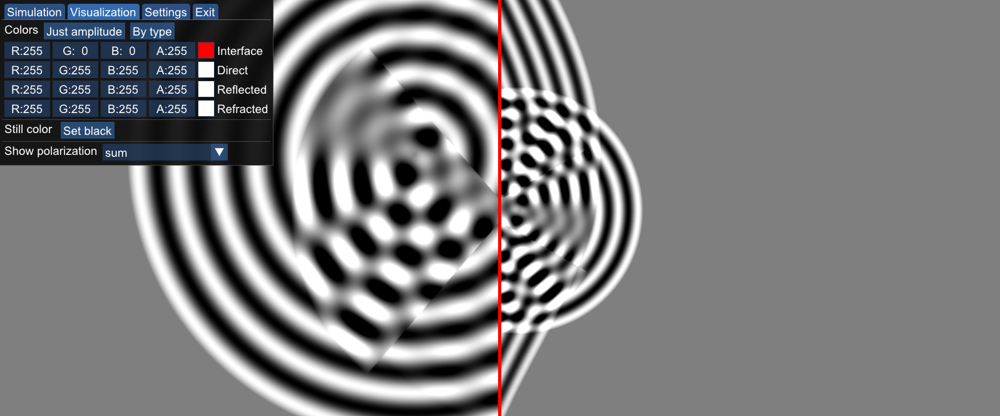

# Waves: A Fresnel equations visualizer

## Features:
- Simulation of light-wave reflection & refraction according to [Fresnel equations](https://en.wikipedia.org/wiki/Fresnel_equations)
- Add pulse or harmning sources of waves anywhere in the field
- View polarization components separately
- View direct & reflected & refracted with different color
- View ray representation of the waves
- Whole simulation is computed on GPU

Made as a project for Physical Optics course at BUT FIT. Graded 29/30 pts.

The demo utilizes [RealEngine](https://github.com/ZADNE/RealEngine) library. Physics regarding the simulation is explained in [documentation](https://github.com/ZADNE/Waves/blob/master/doc.pdf) (czech only).

## Sample images:

